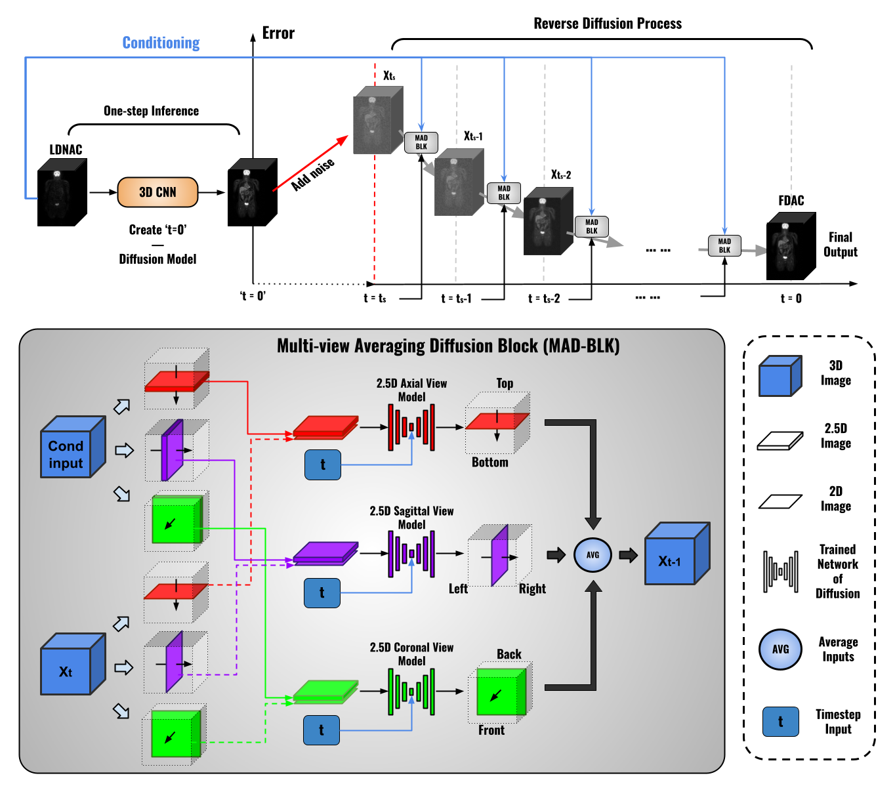

### [MADM: 2.5D Multi-view Averaging Diffusion Model for 3D Medical Image Translation: Application to Low-count PET Reconstruction with CT-less Attenuation Correction](https://arxiv.org/abs/2406.08374)
https://arxiv.org/abs/2406.08374

**Tianqi Chen, Jun Hou, Yinchi Zhou, Huidong Xie, Xiongchao Chen, Qiong Liu, Xueqi Guo, Menghua Xia, James S. Duncan, Chi Liu, Bo Zhou**

This repository contains the official implementation of **MADM** (2.5D Multi-view Averaging Diffusion Model), a novel diffusion-based framework for 3D medical image translation, with a focus on CT-free ultra-low-dose PET reconstruction. MADM enables high-quality recovery of standard-dose, attenuation-corrected PET (AC-SDPET) directly from non-attenuation-corrected low-dose PET (NAC-LDPET), effectively reducing both tracer dosage and eliminating the need for CT-based attenuation correction.

By leveraging lightweight 2.5D conditional diffusion models across axial, coronal, and sagittal views, MADM ensures spatial consistency through multi-view averaging at each denoising step. Additionally, a CNN-based one-step prior generator is used to initialize the diffusion process, enhancing accuracy and reducing inference time.

This framework offers a memory-efficient, slice-consistent, and clinically valuable solution for safe and accurate PET imaging without relying on CT scans.

<p align="center">
  
</p>

---

## 🔬 Project Description

**MADM (Multi-view Attenuation-aware Diffusion Model)** is designed to generate high-quality AC standard-count PET(AC-SDPET) directly from the NAC low-count PET(NAC-LDPET) in 3D with reasonable computation resources without relying on CT scans for attenuation correction. Our method integrates:
- **2.5D Multi-View Diffusion** Lightweight, consistent 3D generation from 2.5D slice in different views.
- **Prior-Guided Denoising** Incorporates CNN-based prior to accelerate diffusion and improve accuracy.
---

## Data preparation
### Paired translation task
For datasets that have paired image data, the path should be formatted as:
```yaml
/path/to/data_root/
├── train/
│   ├── 5NAC/
│   │   ├── patient001_5_NAC.nii
│   │   ├── patient002_5_NAC.nii
│   │   └── ...
│   ├── 100AC/
│   │   ├── patient001_100_AC.nii
│   │   ├── patient002_100_AC.nii
│   │   └── ...
├── val/
│   ├── 5NAC/
│   └── 100AC/
└── test/
    └── 5NAC/

```
For the prior data want to load, the path should be formatted as:
```yaml
/path/to/load_prior_root/
├── patient001_umap_pred.nii
├── patient002_umap_pred.nii
├── patient003_umap_pred.nii
└── ...
```

To perform inference using MADM across multiple views (2.5D: x, y, z), you should train and save a model for each axis independently. During testing or sampling, each model should be loaded from its respective checkpoint.

Recommended Checkpoint Directory Structure
```yaml
/path/to/model_checkpoints/
├── model_x.pt
├── model_y.pt
└── model_z.pt
```
---

## Train and Test
### Training
To train the MADM diffusion model on your 2.5D PET dataset, run the following command: 

```yaml
python train.py
```
Make sure to train a separate model for each axis (x, y, z) using different --train_axis and checkpoint folders. These will later be used for multi-view inference.

If you wish to continue training, specify the model checkpoint path --resume_checkpoint in the train part:
```yaml
python train.py --resume_checkpoint path/to/model_ckpt
```

### Testing
Once training is complete, use the testing script to generate AC-SDPET outputs from NAC-LD input using all trained view models.
```yaml
python sample_3D.py --model_axis x y z --load_prior_root /path/to/load_prior_root --model_root /path/to/ model_checkpoints --save_root /path/to/save_dir
```

### Output
Predictions are saved in NIfTI format under:
```yaml
/path/to/save_dir
└── adj#_models_views/
    ├── *_single/
    │   └── patient001_pred_0.nii
    └── *_comb/
        └── patient001_pred.nii  ← averaged output across samples
```

Each prediction is clipped to non-negative values and saved using the patient ID from the test set. The *_comb directory contains the final averaged predictions per subject.


## Acknowledgement
Our code is implemented based on Guided Diffusion

[Guided Diffusion](http://arxiv.org/abs/2105.05233) 
